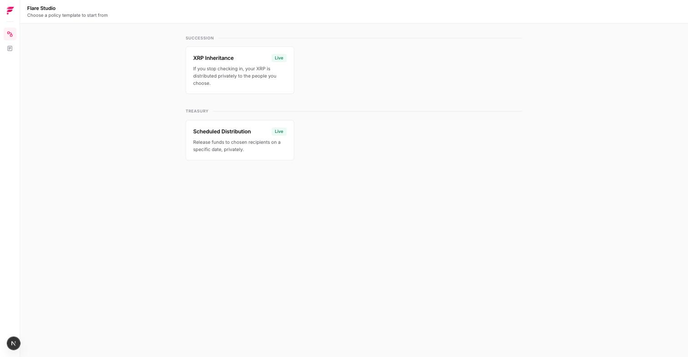
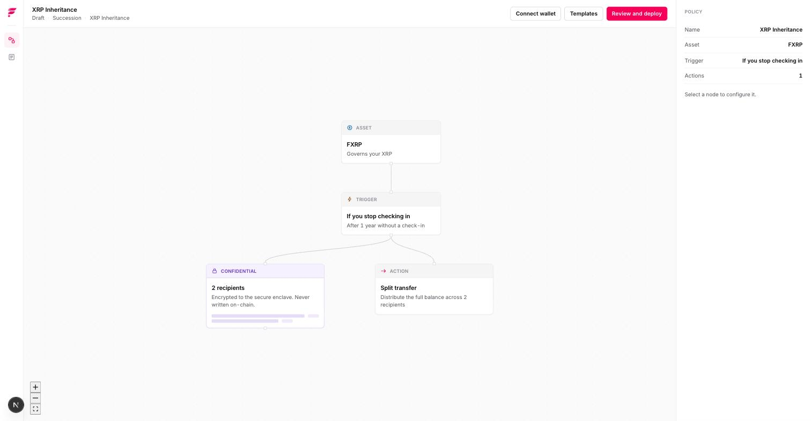
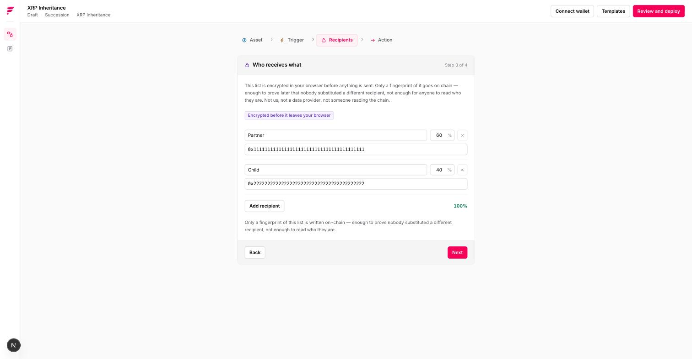
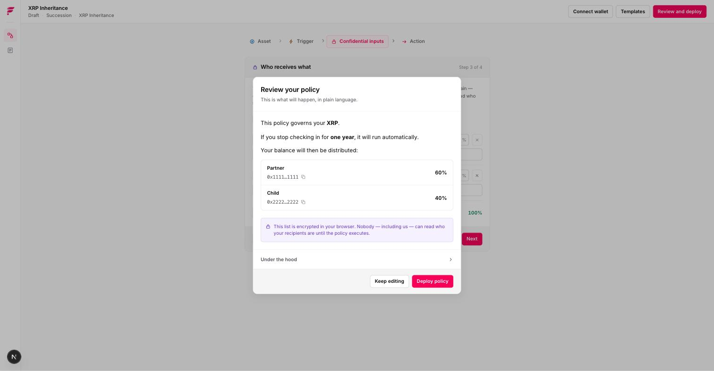
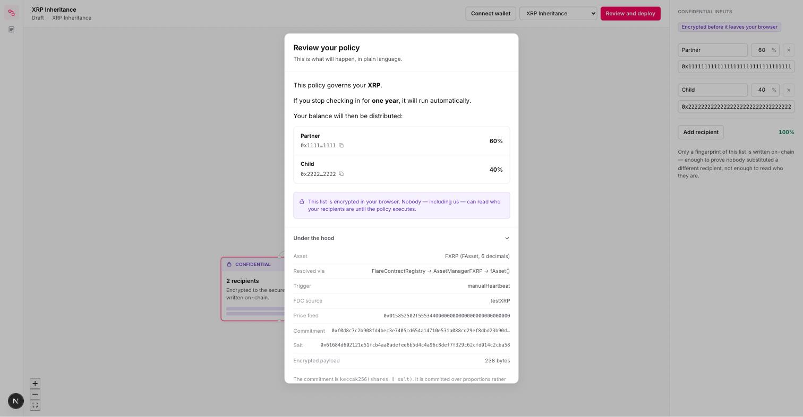
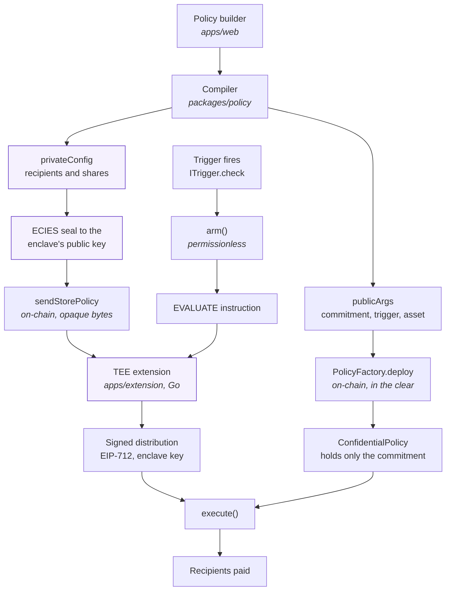

<p align="center">
  
</p>

<p align="center">
  <em>Confidential, self-executing asset policies on Flare.</em>
</p>

<p align="center">
  
  
  
  
</p>

---

## Contents

[The problem](#the-problem) · [What we built](#what-we-built) ·
[Proof it works](#it-works-and-here-is-the-receipt) ·
[Worked example: inheritance](#the-worked-example-xrp-inheritance) ·
[Why Flare](#why-flare) · [Architecture](#architecture) ·
[Why generic is checkable](#why-generic-is-checkable) ·
[What's real today](#whats-real-today) · [What we did not build](#what-we-did-not-build) ·
[Deployed addresses](#deployed-addresses) · [Which bounties](#which-bounties-and-why) ·
[Built during the program](#built-during-the-program) · [Running it](#running-it) ·
[Roadmap](#roadmap)

---

## The problem

Anything conditional you want to do with on-chain money today is a bespoke smart
contract. Vesting, escrow, a trust, a treasury rule, a payout that happens only
if something else does or does not occur — each one is a separate audit, a
separate deployment, and a developer you have to trust and pay.

And two things are unreasonably hard even for that developer:

- **Keeping the terms private.** Putting a policy on-chain normally publishes it.
  Who inherits, who gets paid, what the thresholds are — all of it becomes public
  the moment the contract is deployed.
- **Acting on an absence.** A contract can see what happened. It cannot see what
  *failed* to happen, which is exactly what a dead-man's switch, a missed
  milestone, or a defaulted obligation depends on.

Inheritance is the sharpest instance of both, which is why it is the template we
built first.

---

## What we built

A visual platform for building, deploying, and managing confidential,
self-executing asset policies on Flare.

A **policy** is a rule your assets follow on their own: what is governed, what
has to happen before anything moves, who receives what, and which of that stays
private. You fill it in one primitive at a time. It compiles to real contracts
and runs without you — including when you cannot act, which is usually the moment it
matters.



*Flare Studio opens on a shelf of policy templates, grouped by what they are
for. Inheritance is the first one, not the product.*

### What a policy is made of

Every policy is the same five primitives. Nothing in the engine knows what any
particular policy is *for*.

| | | Ships today |
|---|---|---|
| **Asset** | What is governed | FXRP, live on Coston2. `FBTC` sits in the registry, disabled, and a test compiles a policy against it |
| **Trigger** | What starts evaluation | Three deployed and all three selectable in the builder: an on-chain check-in, a fixed date, and an FDC-attested missing payment |
| **Conditions** | What else must hold | The `ICondition` seam exists and is deliberately empty — see [what we did not build](#what-we-did-not-build) |
| **Confidential inputs** | What nobody may read | Recipients and their shares, sealed to a TEE and never on-chain in the clear |
| **Actions** | What happens | Proportional split to any number of recipients |

Compose those differently and you get different products: inheritance, scheduled
distributions, vesting, escrow, family trusts, treasury controls. **Two of those
ship as templates today** — XRP Inheritance and Scheduled Distribution — and the
rest are what the model is for, not what we are claiming to have built.

## It works, and here is the receipt

Template #1 — XRP Inheritance — ran end to end on live Coston2: a real policy,
real FXRP, a real TEE at `PRODUCTION`, and recipients paid the exact split they
were promised.

```
✓ A received 0.6001 FXRP, exactly their 60.01%
✓ B received 0.3999 FXRP, exactly their 39.99%
✓ no dust was left stranded in the policy
✓ the policy is Executed and can never fire again
```

| | On Coston2 |
|---|---|
| **Execute transaction** | [`0x23969d…f15a`](https://coston2-explorer.flare.network/tx/0x23969dd293a5add553e202fff28f5db9608ea79b70ef1485b23322838503f15a) |
| **The policy it paid out** | [`0x3c9d71…b815`](https://coston2-explorer.flare.network/address/0x3c9d71Cd1D500C22eD34dcE94687Cb1ef585b815) |
| **TEE machine that signed it** | `0x7f7244…0ef5` — status `2`, PRODUCTION |
| **Extension id** | `0x10286` |

That transaction succeeded *because* the recovered EIP-712 signer is a machine
Flare's own registry reports as `PRODUCTION`. Not a mock, not a mode — the gate
is what let the money move.

### Verify it yourself in 60 seconds

No install, no keys — these read the public chain:

```bash
# The TEE that signed the payout is a registered PRODUCTION machine
cast call 0x1a9C4A0f9D76c0b1D91d22E24E573a9b377618aE \
  "getTeeMachineStatus(address)(uint8)" \
  0x7f7244155579108b63b6476ffbbbfa8d61a10ef5 \
  --rpc-url https://coston2-api.flare.network/ext/C/rpc
# => 2

# The policy is Executed and holds nothing back
cast call 0x3c9d71Cd1D500C22eD34dcE94687Cb1ef585b815 "status()(uint8)" \
  --rpc-url https://coston2-api.flare.network/ext/C/rpc   # => 2 (Executed)
cast call 0x3c9d71Cd1D500C22eD34dcE94687Cb1ef585b815 "balance()(uint256)" \
  --rpc-url https://coston2-api.flare.network/ext/C/rpc   # => 0
```

Or run the whole thing yourself — see [Running it](#running-it).

## The worked example: XRP inheritance

If you hold crypto and you die, or lose your keys, it is gone. There is no bank
to call and no branch to visit with a death certificate. A will does not help:
your family cannot reach the assets without your seed phrase, and writing that
phrase somewhere a lawyer can read it means handing someone your money.

As a policy, that is:

1. **Asset** — your FXRP, held by the policy contract.
2. **Trigger** — proof of life. You check in; if you stop for longer than the
   interval you chose, the policy becomes eligible to run.
3. **Confidential inputs** — who receives what. Encrypted in your browser to a
   Trusted Execution Environment. Only a *fingerprint* — a hash — goes on-chain:
   enough to prove later that nobody swapped in a different recipient, not enough
   for anyone to read who they are.
4. **Action** — the balance is split by the shares you fixed, and paid out.

Choosing a template opens the builder. Its steps are the policy's own
primitives, in the order the engine evaluates them — so a template with two
actions, or a condition, or nothing confidential grows a step by itself:



Who receives what is edited like any other form field — and encrypted before it
leaves the page:



The review step states the policy in plain language, with no blockchain
vocabulary anywhere in the primary flow:



Change the trigger to a date and the same machinery is a scheduled distribution.
Change it to a price and it is a conditional allocation. The engine does not
know the difference, and that is the point.

## Why Flare

| | |
|---|---|
| **FAssets** ✅ | Holds real XRP inside a smart contract as FXRP — a live FAsset on Coston2, not a mock token. The demo moves real FXRP. |
| **FCC** ✅ | The policy is decrypted and evaluated inside a TEE registered with Flare's `FlareTeeManager`, validated by data-provider consensus. `execute()` accepts a distribution only from a machine the registry reports as `PRODUCTION` — which is why the payout in the run below went through. |
| **FDC** ✅ | `ReferencedPaymentNonexistence` proves an expected payment *did not arrive* by a deadline. Proving an absence is normally impossible for a contract — it can only see what did happen — and this is what turns proof-of-life from a self-reported timer into an attested observation. `FdcNonexistenceTrigger` is deployed and consumes proofs through Flare's `FdcVerification`. |

All three are load-bearing, and each one is doing work the others cannot.

### The two proof-of-life triggers

`ManualHeartbeatTrigger` is an on-chain check-in: the owner calls a function to
say they are still here. It is a real dead-man's switch and it is what the
end-to-end demo runs on, because it is deterministic and needs no XRPL wallet.
But the owner is *asserting* liveness rather than the protocol *observing* it.

`FdcNonexistenceTrigger` replaces the assertion with evidence. The owner sends a
small XRPL payment carrying the policy's own reference; FDC attests that no such
payment arrived before the deadline. **The owner proves presence; the protocol
proves absence.**

Building the second one required a new `ITrigger` and nothing else — no change
to `ConfidentialPolicy`, no schema change, no compiler branch. That is the third
trigger through the same seam, which is the genericity claim being tested rather
than asserted.

Seven things are checked before a proof may fire a policy, and each one is a way
a genuine proof could otherwise fire the wrong policy. The subtlest: a request
may restrict *which senders count*, so an attacker could pick a source-address
set the owner never pays from and prove a truthful irrelevance. We require that
filter to be off. See `FdcNonexistenceTrigger.check` — every check has a named
error and a test.

### Under the hood

Every piece of Flare vocabulary lives behind one disclosure, which is also
exactly where a reviewer will look:



FAsset resolution path, the commitment, the salt, and the size of the sealed
payload — the same values the contracts and the enclave use.

## Architecture

```
apps/web           Next.js — policy builder, deployment manager, monitor
apps/extension     Go — the Flare Compute Extension (evaluates policies in the TEE)
apps/orchestrator  TypeScript — non-confidential work: FDC pipeline, instruction sending
packages/policy    Shared policy IR: schema, compiler, commitment, ECIES
packages/contracts Solidity — the policy engine
```

The path a policy takes, and where the plaintext is allowed to exist:



The shaded path is the only place the recipient list exists in plaintext: the
user's browser, and inside the enclave. It is sealed before it leaves the
browser and submitted to the chain directly, so no server of ours ever holds it
— which is why the orchestrator can run on ordinary hosting without weakening
the claim.

### The security model

`execute()` requires two independent things, and neither alone is sufficient:

1. **An attested signer** — the recovered EIP-712 signer must be a `PRODUCTION`
   TEE machine according to Flare's registry. This stops anyone else signing.
2. **A matching commitment** — the revealed distribution must hash to the
   commitment fixed at deploy time. This stops *even an attested machine* from
   substituting a different payout.

Both are covered by tests, including one where the attested machine itself tries
to redirect the funds.

## Why generic is checkable

It is template #1. The engine is deliberately ignorant of it: `ConfidentialPolicy`
holds no heartbeat interval, no deadline, no price threshold, no notion of an
estate. Trigger state lives behind `ITrigger`, condition state behind
`ICondition`.

"Generic" is easy to assert and easy to fake, so it is tested rather than
claimed:

- **Three triggers, one engine.** A check-in, a fixed date, and an FDC-attested
  missing payment. The third cost one contract — no change to
  `ConfidentialPolicy`, no schema change, no compiler branch.
- **Two templates, one code path.** `compile.test.ts` runs both through the same
  compiler and asserts they differ *only* in their trigger: same recipients, same
  salt, byte-identical confidential half. It is visible in the builder too: every
  trigger is selectable on any template, so an inheritance policy switched to a
  fixed date is still the same engine, the same contracts, and the same
  confidential half — one step changes and nothing else does.
- **Two assets, no code change.** A policy compiles against `FBTC` — a different
  chain with different decimals — with no change outside `assets.ts`. Adding an
  FAsset the day it goes live is one registry entry.
- **A guard in CI.** `scripts/lint-genericity.sh` fails the build if template
  vocabulary — *inherit*, *beneficiary*, *heir*, *dead-man* — reaches engine
  code. The engine's word is `recipient`. It runs over 204 files on every push.

The multi-chain story is not ours to invent either: FDC's
`ReferencedPaymentNonexistence` supports XRP, BTC and DOGE, so the proof-of-life
trigger takes the source chain as a parameter rather than baking one in.

---

## What's real today

We would rather be precise than impressive. "Built" below means tested; where
something is written but has not been run against the live network, it says so.

- ✅ **Policy engine contracts** — deploy, fund, arm, execute, cancel. 56 tests,
  including both attestation negative cases, the commitment negative cases, and
  one where an attested machine itself tries to redirect the funds.
- ✅ **Attestor gate, fork-tested** against the live `FlareTeeManager` on Coston2,
  not only against a mock. That test found a real bug on its first run: the
  deployed manager reverts for an unregistered address rather than returning a
  status, so `SignerNotAttested` could never have fired in production. The gate
  now fails closed.
- ✅ **Policy IR + compiler** — 60 tests. Both templates compile through one code
  path with no branch on template name, and a policy compiles against a second
  asset with no change outside `assets.ts`.
- ✅ **Cross-language commitment** — computed in TypeScript, checked in Solidity,
  re-derived in Go, with all three asserted against one shared fixture.
- ✅ **Go TEE extension** — custom `POLICY` op type, `STORE` and `EVALUATE`
  handlers, ECIES decrypt, EIP-712 signing.
- ✅ **Builder, Deployment Manager, Monitor** — the full browser flow: compile,
  seal, deploy, configure the trigger, hand off to the enclave, fund, check in,
  and the demo control.
- ✅ **Proven end to end on live Coston2.** `pnpm demo` compiles a policy, seals
  it, deploys it, funds it with real FXRP, hands the sealed half to the enclave,
  checks in, misses the next deadline, arms, has the enclave evaluate and sign,
  and executes — then asserts the recipients received exactly the split fixed at
  deploy time, that no dust was stranded, and that the policy can never fire
  again. Last run: recipients paid 0.6001 and 0.3999 FXRP against a 60.01/39.99
  split, [execute tx](https://coston2-explorer.flare.network/tx/0x23969dd293a5add553e202fff28f5db9608ea79b70ef1485b23322838503f15a).
- ✅ **The enclave hand-off works.** A registered machine at `PRODUCTION` opens
  the sealed policy and answers `{"stored":true,"shareCount":2}` — a count, never
  a recipient. `pnpm handoff-check` is that path on its own, and needs no FXRP.
- ✅ **The attestation gate is load-bearing, not decorative.** `execute()`
  succeeded only because the recovered EIP-712 signer is a machine Flare's
  registry reports as `PRODUCTION`. That is the Bounty 2 claim, demonstrated.
- ✅ **FDC proof-of-life trigger** — `FdcNonexistenceTrigger` is deployed at
  [`0xB13cD1…e902`](https://coston2-explorer.flare.network/address/0xB13cD1E8899A1F36eAEE11E0eC2B4DCaCeeCe902),
  wired to Flare's `FdcVerification` resolved from the registry. 17 unit tests,
  one per rejection path, plus a fork test confirming our interface matches the
  deployed verifier and that a fabricated proof is refused.
- ⚠️ **The FDC trigger has not fired end to end.** The contract verifies proofs
  and the interface is fork-tested, but no XRPL payment has been made and no
  real attestation has been requested from the Data Availability layer, so the
  full pipeline is unproven. The demo runs on the check-in trigger. This is the
  honest remaining gap.

### Honest scope notes

- **Proof-of-life, not passive monitoring.** The owner actively sends a small
  payment before each deadline. `ReferencedPaymentNonexistence` proves a
  *specific expected payment* is missing; it cannot prove a wallet did nothing.
- **The TEE decrypts policy contents to evaluate them.** That is what a TEE is
  for. The operator cannot read that memory and the contract accepts results only
  from an attested image — it does not mean nobody ever decrypts.
- **We run `SIMULATED_TEE=true` on Coston2.** The attestation path is real end to
  end — registration, governance, data-provider consensus, `PRODUCTION` status,
  signed results. Simulation replaces the hardware measurement with a fixed code
  hash; the same code runs unchanged against a real Confidential VM.
- **`simulateInactivity()`** exists so the demo is deterministic — you cannot
  fast-forward a testnet, and a twelve-month timer does not demo. It is inert
  unless `demoMode` was set at deploy, and the UI labels it as a demo control.

---

## What we did not build

Worth stating plainly, because a submission that only lists wins is harder to
trust than one that draws its own edges:

- The FDC trigger has never fired from a real attestation — see
  [What's real today](#whats-real-today).
- `priceAbove` is an `ICondition` with no implementation. The seam is there and
  deliberately empty; FTSO is not integrated and we do not claim it.
- There is no mainnet deployment, no audit, and no key recovery for a lost
  browser vault beyond the backup the app prompts you to download.

---

## Deployed addresses

Everything below is live on Coston2 (chain id 114) and resolvable in the
explorer. Our contracts are deployed by `forge script script/Deploy.s.sol`;
Flare's are resolved from `FlareContractRegistry` at runtime, never hardcoded —
Coston2 has been redeployed once already and stale literals are the most common
way this stack breaks.

| Contract | Address |
|---|---|
| `PolicyFactory` | [`0x121B80…F854`](https://coston2-explorer.flare.network/address/0x121B80EBe51Ea8A8f352fA5Cfe70c080c9E2F854) |
| `TeeAttestorGate` | [`0x40Fb70…747C`](https://coston2-explorer.flare.network/address/0x40Fb70601Fa6d77137bb87ee7eD1a98D7337747C) |
| `ManualHeartbeatTrigger` | [`0xdE3745…9C5e`](https://coston2-explorer.flare.network/address/0xdE37452BAFC3618Ae5efa41eE4F05b62F42a9C5e) |
| `TimestampTrigger` | [`0x059569…B06c`](https://coston2-explorer.flare.network/address/0x059569623780303633f9699E77Bd69143B7bB06c) |
| `FdcNonexistenceTrigger` | [`0xB13cD1…e902`](https://coston2-explorer.flare.network/address/0xB13cD1E8899A1F36eAEE11E0eC2B4DCaCeeCe902) |
| `PolicyInstructionSender` | [`0xC57fD1…66c7`](https://coston2-explorer.flare.network/address/0xC57fD12f9EbA54170797Ea42745dC02983bd66c7) |
| FXRP *(Flare's)* | [`0x0b6A36…3dc7`](https://coston2-explorer.flare.network/address/0x0b6A3645c240605887a5532109323A3E12273dc7) |
| `FlareTeeManager` *(Flare's)* | [`0x1a9C4A…18aE`](https://coston2-explorer.flare.network/address/0x1a9C4A0f9D76c0b1D91d22E24E573a9b377618aE) |
| `FdcVerification` *(Flare's)* | [`0x906507…B933`](https://coston2-explorer.flare.network/address/0x906507E0B64bcD494Db73bd0459d1C667e14B933) |

---

## Which bounties, and why

Submitted to both, from one build. Each bounty has a delta on top of a shared
core, and both deltas landed.

**Interoperable Asset Products.** The policy governs FXRP — a live FAsset on
Coston2, resolved from the registry through `AssetManagerFXRP → fAsset()`, never
a hardcoded token. Real FXRP moved in the run above. Assets are configuration:
`assets.ts` already carries an FBTC entry, and a test compiles a policy against
it to prove that adding an asset is one registry entry and no code change.

**Confidential Compute Apps.** The runtime is a Flare Compute Extension written
in Go, registered with `FlareTeeManager`, and reaching `PRODUCTION`. The private
half of a policy is ECIES-sealed in the browser, submitted on-chain as opaque
bytes, and opened only inside the enclave. `execute()` accepts a distribution
only from an attested machine *and* only if it hashes to the commitment fixed at
deploy time — so even a fully compromised enclave cannot redirect a payout, only
authorise the split the owner already chose.

The second one is the harder claim, and it is why the TEE work came first:
encryption plus a key-holding server is the superficial answer to a bounty named
Confidential Compute. There is no server. The plaintext exists in the owner's
browser and inside the enclave, and nowhere in between.

---

## Built during the program

Everything below is new work unless the row says otherwise. The one thing that is
not ours is called out explicitly, because `apps/extension` is a fork of Flare's
`fce-` scaffold and the raw diff would otherwise flatter us by about 20,000 lines.

| | Lines | What |
|---|---|---|
| `packages/contracts/src` | 855 | `ConfidentialPolicy`, `PolicyFactory`, `TeeAttestorGate`, `ITrigger`/`ICondition`, and three triggers: manual check-in, timestamp, FDC nonexistence |
| `packages/contracts/test` | 1,158 | 56 tests, including two fork tests against live Coston2 — `FlareTeeManager` and `FdcVerification` |
| `packages/policy/src` | 998 | Policy IR + zod schema, compiler, commitment, ECIES to geth's profile, payment references, asset registry, two templates |
| `packages/policy/test` | 689 | 60 tests, including the cross-language commitment vectors, the payment-reference vectors and the enclave wire format |
| `apps/web` | 5,400 | Template gallery, IR-derived policy form, review step, Deployment Manager, Monitor, wallet, deploy flow, 52 tests |
| `apps/orchestrator` | 1,236 | Instruction sending, evaluate/execute round trip, `pnpm demo`, `pnpm handoff-check` |
| `scripts` | 460 | Genericity guard, `pnpm preflight`, `pnpm sync-web-env` |
| Extension — **ours** | 1,220 | `policy.go` (commitment + EIP-712 in Go), the `STORE`/`EVALUATE` handlers in `extension.go`, `types.go`, `InstructionSender.sol`, and 608 lines of Go tests |
| Extension — **scaffold** | ~20,000 | Flare's `fce-` example: Docker compose, tee-node/proxy wiring, deploy tooling, language templates. Forked, not written. |

**179 tests across three languages**, plus 29 Go test functions in the enclave —
all runnable offline except the two fork tests, which skip themselves without a
network.

Three things worth singling out, because they are the parts that were not
obvious:

- **The commitment exists three times** — TypeScript computes it, Solidity checks
  it, Go re-derives it inside the enclave. All three are asserted against one
  committed fixture, so a divergence fails a test rather than a demo.
- **ECIES had to be written twice** to geth's exact profile — AES-128-CTR, a
  concatenation KDF, and an HMAC key that is hashed a second time. `eciesjs`
  defaults to AES-256-GCM and produces ciphertext the enclave cannot open.
- **The signature path** wraps an EIP-712 digest in the EIP-191 envelope, because
  the TEE node signs via `accounts.TextHash` and offers no way out. Recovering
  the bare digest — the obvious reading — fails for every signature a real
  machine can produce.
- **An FDC proof can be true and irrelevant.** A nonexistence request may
  restrict *which senders count*, so an attacker can pick a source-address set
  the owner never pays from and obtain an honest attestation that nothing
  arrived. `FdcNonexistenceTrigger` refuses any proof with that filter set.
  Absence only means something once you have fixed what you were looking for.

## Running it

Requires Node 20+, pnpm, [Foundry](https://getfoundry.sh), and Go 1.22+ for the
extension.

```bash
git clone --recurse-submodules <this repo>
pnpm install
```

The `--recurse-submodules` matters: `forge-std` and `openzeppelin-contracts` are
pinned submodules. If you already cloned without it, `git submodule update
--init --recursive`.

**Everything that runs offline** — this is what CI runs, and it needs no keys,
no funds and no network beyond a package install:

```bash
pnpm test                                    # policy, orchestrator, contracts
./scripts/lint-genericity.sh                 # the engine may not learn what an inheritance is
pnpm -r typecheck
cd packages/contracts && forge test          # 56 tests, incl. two Coston2 fork tests
cd apps/extension/go && go test ./...
```

The fork tests skip themselves if the Coston2 RPC is unreachable, so a working tree
without network access still goes green.

**Is this machine ready?**

```bash
pnpm preflight
```

Checks the toolchain, the enclave stack, the deployer's funding and the deployed
contracts — including that each recorded address actually has code on Coston2 —
and prints the specific command to fix whatever is missing. Run it before
anything that costs gas. It never prints a key.

**The app:**

```bash
cp apps/web/.env.example apps/web/.env.local   # then fill in the deployed addresses
pnpm --filter @flare-studio/web dev            # http://localhost:3000/studio
```

The builder and the review step work without any of that. Deploying needs a
deployed engine to point at, and the app will tell you so rather than sending a
transaction to an empty address.

**The end-to-end run** — the real regression test. This one costs gas and needs
a live enclave:

```bash
pnpm demo
```

It compiles a policy, seals it, deploys, funds it with real FXRP, hands the
sealed half to the enclave, checks in, misses the next deadline, arms, has the
enclave sign, executes, and then asserts that each recipient received exactly
the share fixed at deploy time and that no dust was stranded. The script prints
what it needs if the environment is incomplete.

---

## Roadmap

**Next, and small:** fire the FDC trigger from a real XRPL payment. The contract
and its verification path are done; what remains is the request/attest/retrieve
round trip through the Data Availability layer. That is the one gap in this
README and it is measured in hours, not architecture.

**The headline: Protocol Managed Wallets.** Today a user holds wrapped FXRP, so
inheritance operates on a wrapped token. FCC lists PMW — programmable assembly
and signing of transactions on external chains — as a system application. With
it, a policy could custody **native XRP on the XRPL** and have the TEE assemble
and sign the real payments to recipients. No minting step, no wrapper: you
bequeath your actual XRP.

That is a roadmap item with a named primitive behind it rather than a wish — the
mechanism already exists in Flare's architecture. It is also deliberately not
claimed as built: there is no PMW developer guide yet, and the sign-extension
documents only arbitrary secp256k1 signing. FXRP is the shipped path.

**Then the platform argument.** More templates (family trust, escrow, vesting,
treasury controls), more assets as FAssets go live, and third-party developers
publishing templates. The architecture is already pointed this way: a third
trigger cost one contract, a second asset costs one registry entry, and a
mechanical guard fails CI if template vocabulary ever reaches engine code.

## License

MIT — see [LICENSE](LICENSE).
